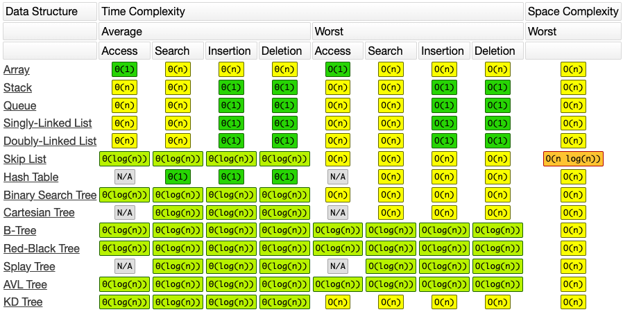
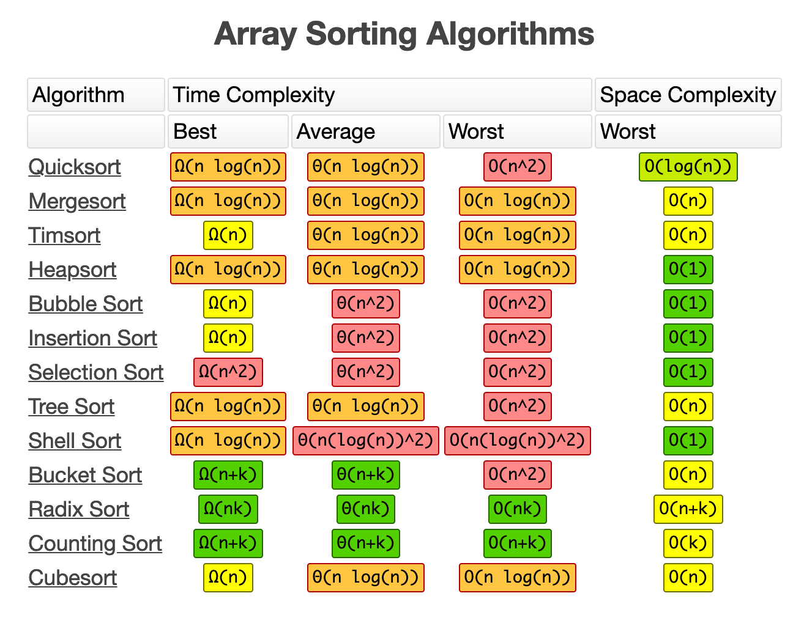
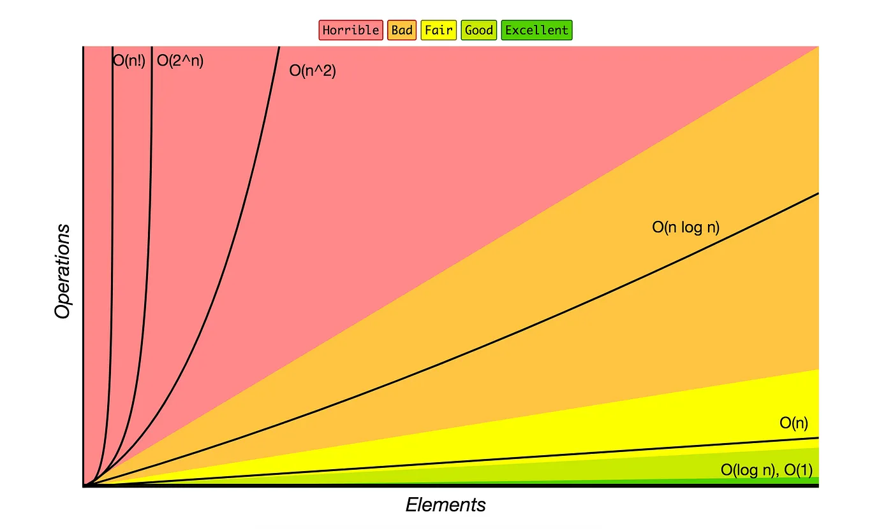

# DSA (Data Structures and Algorithms) Interview Questions & Answers

### Table of Contents

| Questions                                                                                                                                   |
| ------------------------------------------------------------------------------------------------------------------------------------------- |
| [What is Data](#What-is-Data)                                                                                                               |
| [What is Structure](#What-is-Structure)                                                                                                     |
| [What is Data Structure](#What-is-Data-Structure)                                                                                           |
| [Type of Data Structure](#Type-of-Data-Structure)                                                                                           |
| [What are some applications of Data Structures](#What-are-some-applications-of-Data-Structures)                                             |
| [What is the difference between file structure and storage structure](#What-is-the-difference-between-file-structure-and-storage-structure) |
| [What is Array](#What-is-Array)                                                                                                             |
| [Why do we need an array](#Why-do-we-need-an-array)                                                                                         |
| [What is Time Complexity](#What-is-Time-Complexity)                                                                                         |
| [What is Space Complexity](#What-is-Space-Complexity)                                                                                       |
| [What is Difference Between time complexity and space complexity](#What-is-Difference-Between-time-complexity-and-space-complexity)         |
| [Time Complexities and Space Complexities Sheet and Big O Graph](#Time-Complexities-and-Space-Complexities-Sheet-and-Big-O-Graph)           |
| [What is Difference between Linear Search and Binary Search](#What-is-Difference-between-Linear-Search-and-Binary-Search)                   |
| [What is Brute Force Algorithm](#What-is-Brute-Force-Algorithm)                                                                             |
| [What is kadane Algorithm](#What-is-kadane-Algorithm)                                                                                       |
| [What is Bubble Sort](#What-is-Bubble-Sort)                                                                                                 |
| [What is Selection Sort](#What-is-Selection-Sort)                                                                                           |
| [What is Insertion Sort](#What-is-Insertion-Sort)                                                                                           |
|                                                                                                                                        |

---

### What is Data
   
  Anytthing to give information is called data. It can be a number, string or even an image.

  **[⬆ Back to Top](#table-of-contents)**

  ---

### What is Structure
   
  A structure in programming refers to the way data is organized within a computer program.

  **[⬆ Back to Top](#table-of-contents)**

  ---

###  What is Data Structure

  The term "data structure" comes from the field of mathematics where it was known as "structural analysis".

  A data structure is a way of organizing and storing data in a computer so that it can be accessed and worked with efficiently. It is a specialized format for organizing, processing, retrieving and storing data.

  **[⬆ Back to Top](#table-of-contents)**

  ---

### Type of Data Structure

  Data structures can be broadly classified into two main types:

  1. **Linear Data Structures**: In linear data structures, data elements are arranged in a sequential manner where each element is connected to its previous and next element. Examples include:
     - Arrays
     - Linked Lists
     - Stacks
     - Queues

  2. **Non-linear Data Structures**: In non-linear data structures, data elements are not arranged in a sequential manner. Instead, they are arranged in a hierarchical manner where each element can have multiple connections to other elements. Examples include:
     - Trees
     - Graphs
     - Hash Tables

   **[⬆ Back to Top](#table-of-contents)**
   
   ---

### What are some applications of Data Structures

  1. **Database Management Systems (DBMS)**: Data structures like B-trees and hash tables are used for indexing and efficiently storing and retrieving data in databases.

  2. **Operating Systems**: Data structures such as queues, stacks, and linked lists are used for managing system resources, scheduling tasks, and maintaining process control blocks.

  3. **Compiler Design**: Data structures like symbol tables, abstract syntax trees, and intermediate representations are used in compilers for parsing, semantic analysis, and code generation.

  4. **Networking**: Data structures such as graphs are used in network routing algorithms, while hash tables are used in implementing network protocols and addressing schemes.

  5. **Artificial Intelligence and Machine Learning**: Data structures like trees and graphs are used to represent and manipulate complex data structures in AI and ML algorithms, such as decision trees and neural networks.

  6. **Graphics and Computer Games**: Data structures like trees and graphs are used for spatial partitioning and collision detection in 2D and 3D graphics rendering and game development.

  7. **Web Development**: Data structures like arrays and linked lists are used for managing and manipulating data in web applications, while hash tables are used for caching and optimizing web server performance.

  8. **Embedded Systems**: Data structures are used in embedded systems for efficient memory management and real-time processing of sensor data.

   **[⬆ Back to Top](#table-of-contents)**
   
---

### What is the difference between file structure and storage structure

  **File structure** refers to how data is organized within a file, including its format, encoding, and organization. 
  
  **Storage structure** refers to how data is physically stored on a storage device, such as disk blocks or memory cells. 
  
  Both are essential for efficient data storage and retrieval in computer systems.

   **[⬆ Back to Top](#table-of-contents)**
   
---

### What is Array
  An array is a linear data structure consisting of a collection of elements stored at contiguous memory locations. Each element in an array is accessed by its index, which represents its position within the array. Arrays can store elements of the same data type and provide constant-time access to elements.

  **[⬆ Back to Top](#table-of-contents)**
   
---

###  Why do we need an array

  Arrays provide a structured way to store and access multiple elements of the same data type in a contiguous memory block. They offer efficient random access, enabling easy manipulation, iteration, and processing of data, making them essential for organizing and managing collections of data in various algorithms and applications.

   **[⬆ Back to Top](#table-of-contents)**
   
---

### What is Time Complexity

  **Time complexity** refers to the amount of time an algorithm takes to complete as a function of the length of its input. It measures how the runtime of an algorithm grows with the size of the input data. Time complexity is typically expressed using big O notation.

   **[⬆ Back to Top](#table-of-contents)**
   
---

### What is Space Complexity

  **Space complexity** refers to the amount of memory space an algorithm requires as a function of the length of its input. It measures how the memory usage of an algorithm grows with the size of the input data. Space complexity is also typically expressed using big O notation.

   **[⬆ Back to Top](#table-of-contents)**
   
---

### What is Difference Between time complexity and space complexity

  | Aspect       | Time Complexity                                                                                                            | Space Complexity                                                                                                                            |
  | ------------ | -------------------------------------------------------------------------------------------------------------------------- | ------------------------------------------------------------------------------------------------------------------------------------------- |
  | Definition   | Represents the amount of time taken by an algorithm to run as a function of the input size.                                | Represents the amount of memory space taken by an algorithm to run as a function of the input size.                                         |
  | Measure      | Typically measured in terms of the number of basic operations (e.g., comparisons, assignments) performed by the algorithm. | Typically measured in terms of the amount of memory used by the algorithm, including variables, data structures, and recursive call stacks. |
  | Notation     | Usually expressed using Big O notation (e.g., O(n), O(n^2)) to denote the worst-case time complexity of an algorithm.      | Also expressed using Big O notation (e.g., O(n), O(n^2)) to denote the worst-case space complexity of an algorithm.                         |
  | Importance   | Indicates how the runtime of an algorithm scales with the input size, helping to assess efficiency.                        | Indicates how much memory an algorithm consumes with respect to the input size, which is crucial for resource-constrained environments.     |
  | Optimization | Focuses on reducing the number of operations performed by the algorithm to improve efficiency.                             | Focuses on minimizing the amount of memory used by the algorithm, such as optimizing data structures or reducing unnecessary allocations.   |

   **[⬆ Back to Top](#table-of-contents)**
   
---

### Time Complexities and Space Complexities Sheet and Big O Graph

  **Worst Case Time Complexity:** The absolute most number of times an operation needs to be done before completed
  **Average Case Time Complexity:** The average number of times it will take for the algorithm / code to complete
  **Amortized Running Time:** Similar to average, it is the number of times the operation will take when run a sufficient amount of time consecutively
  **Best Case Time Complexity:** The fastest number of times an operation needs to complete

  

  

  

  

  

   **[⬆ Back to Top](#table-of-contents)**
   
---

### What is Difference between Linear Search and Binary Search

  Linear search and binary search are both algorithms used to search for an element in a list or array, but they differ in their approach, efficiency, and implementation.

  Here's a comparison between Linear Search and Binary Search:

  | Aspect           | Linear Search                                                                                                                 | Binary Search                                                                                                                            |
  | ---------------- | ----------------------------------------------------------------------------------------------------------------------------- | ---------------------------------------------------------------------------------------------------------------------------------------- |
  | Approach         | Sequentially checks each element in the list/array until the target element is found or the end of the list/array is reached. | Divides the list/array into halves and repeatedly narrows down the search range by comparing the target element with the middle element. |
  | Complexity       | Time complexity: O(n) (linear)                                                                                                | Time complexity: O(log n) (logarithmic)                                                                                                  |
  | Data Requirement | Works on both sorted and unsorted lists/arrays.                                                                               | Requires the list/array to be sorted beforehand.                                                                                         |
  | Performance      | Suitable for small lists/arrays or unsorted data.                                                                             | Suitable for large lists/arrays or sorted data.                                                                                          |
  | Implementation   | Simple to implement.                                                                                                          | Requires a sorted list/array and more complex implementation.                                                                            |
  | Iterations       | May require scanning through the entire list/array in the worst case.                                                         | Halves the search space with each iteration, resulting in fewer iterations.                                                              |
  | Examples         | Searching a name in a phone book.                                                                                             | Searching a word in a dictionary.                                                                                                        |

  
  **[⬆ Back to Top](#table-of-contents)**
   
---

### What is Brute Force Algorithm

  Brute force refers to a straightforward problem-solving approach where all possible solutions are systematically tried until the correct one is found. While conceptually simple and easy to implement, brute force algorithms may be inefficient for large problem instances due to their exponential time complexity.

  **[⬆ Back to Top](#table-of-contents)**
   
---

### What is kadane Algorithm

  Kadane's algorithm is a dynamic programming approach used to find the maximum sum of a contiguous subarray within an array of numbers. It efficiently computes the maximum subarray sum by iterating through the array once and keeping track of the maximum sum seen so far.

  **[⬆ Back to Top](#table-of-contents)**
   
---

### What is Bubble Sort

  Bubble Sort is a simple sorting algorithm that repeatedly steps through the list, compares adjacent elements, and swaps them if they are in the wrong order. It iterates through the list until no more swaps are needed, resulting in the elements "bubbling" into their correct positions.

  **[⬆ Back to Top](#table-of-contents)**
   
---

### What is Selection Sort

  Selection Sort iteratively selects the smallest (or largest) element from the unsorted part of the array and swaps it with the first element of the unsorted part. This process continues until the entire array is sorted. It has a time complexity of O(n^2) in all cases.

  **[⬆ Back to Top](#table-of-contents)**
   
---

### What is Insertion Sort

  Insertion Sort is a simple sorting algorithm that builds the final sorted array one element at a time. It iterates over each element, comparing it with the already sorted elements and inserting it into its correct position, shifting the larger elements to the right.

  **[⬆ Back to Top](#table-of-contents)**
   
---

### 